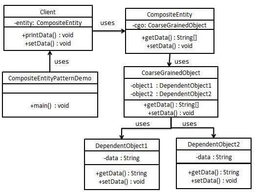

# Composite Entity Pattern

Composite Entity pattern is used in EJB persistence mechanism. A Composite entity is an EJB entity bean which represents a graph of objects. When a composite entity is updated, internally dependent objects beans get updated automatically as being managed by EJB entity bean. Following are the participants in Composite Entity Bean.

- *Composite Entity* - It is primary entity bean. It can be coarse grained or can contain a coarse grained object to be used for persistence purpose.

- *Coarse-Grained Object* - This object contains dependent objects. It has its own life cycle and also manages life cycle of dependent objects.

- *Dependent Object* - Dependent object is an object which depends on coarse grained object for its persistence lifecycle.

- *Strategies* - Strategies represents how to implement a Composite Entity.

## Implementation

We are going to create CompositeEntity object acting as CompositeEntity. CoarseGrainedObject will be a class which contains dependent objects. CompositeEntityPatternDemo, our demo class will use Client class to demonstrate use of Composite Entity pattern.



## Step 1

Create Dependent Objects.

_DependentObject1.java_

```java
public class DependentObject1 {
	
   private String data;

   public void setData(String data){
      this.data = data; 
   } 

   public String getData(){
      return data;
   }
}
```

_DependentObject2.java_

```java
public class DependentObject2 {
	
   private String data;

   public void setData(String data){
      this.data = data; 
   } 

   public String getData(){
      return data;
   }
}
```

## Step 2

Create Coarse Grained Object.

_CoarseGrainedObject.java_

```java
public class CoarseGrainedObject {
   DependentObject1 do1 = new DependentObject1();
   DependentObject2 do2 = new DependentObject2();

   public void setData(String data1, String data2){
      do1.setData(data1);
      do2.setData(data2);
   }

   public String[] getData(){
      return new String[] {do1.getData(),do2.getData()};
   }
}
```

## Step 3

Create Composite Entity.

_CompositeEntity.java_

```java
public class CompositeEntity {
   private CoarseGrainedObject cgo = new CoarseGrainedObject();

   public void setData(String data1, String data2){
      cgo.setData(data1, data2);
   }

   public String[] getData(){
      return cgo.getData();
   }
}
```

## Step 4

Create Client class to use Composite Entity.

_Client.java_

```java
public class Client {
   private CompositeEntity compositeEntity = new CompositeEntity();

   public void printData(){
   
      for (int i = 0; i < compositeEntity.getData().length; i++) {
         System.out.println("Data: " + compositeEntity.getData()[i]);
      }
   }

   public void setData(String data1, String data2){
      compositeEntity.setData(data1, data2);
   }
}
```

## Step 5

Use the Client to demonstrate Composite Entity design pattern usage.

_CompositeEntityPatternDemo.java_

```java
public class CompositeEntityPatternDemo {
   public static void main(String[] args) {
   
       Client client = new Client();
       client.setData("Test", "Data");
       client.printData();
       client.setData("Second Test", "Data1");
       client.printData();
   }
}
```

## Step 6

Verify the output.

```
Data: Test
Data: Data
Data: Second Test
Data: Data1
```

:octocat: [Check more about Design Patterns in my repository.](https://github.com/FernandoCalmet/Design-Patterns)

## Support me ☕💖

<a href='https://ko-fi.com/fernandocalmet' target='_blank'>
  
</a>
