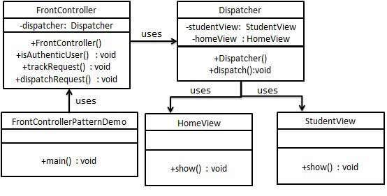

# Front Controller Pattern

The front controller design pattern is used to provide a centralized request handling mechanism so that all requests will be handled by a single handler. This handler can do the authentication/ authorization/ logging or tracking of request and then pass the requests to corresponding handlers. Following are the entities of this type of design pattern.

- *Front Controller* - Single handler for all kinds of requests coming to the application (either web based/ desktop based).

- *Dispatcher* - Front Controller may use a dispatcher object which can dispatch the request to corresponding specific handler.

- *View* - Views are the object for which the requests are made.

## Implementation

We are going to create a FrontController and Dispatcher to act as Front Controller and Dispatcher correspondingly. HomeView and StudentView represent various views for which requests can come to front controller.

FrontControllerPatternDemo, our demo class, will use FrontController to demonstrate Front Controller Design Pattern.



## Step 1

Create Views.

_HomeView.java_

```java
public class HomeView {
   public void show(){
      System.out.println("Displaying Home Page");
   }
}
```

_StudentView.java_

```java
public class StudentView {
   public void show(){
      System.out.println("Displaying Student Page");
   }
}
```

## Step 2

Create Dispatcher.

_Dispatcher.java_

```java
public class Dispatcher {
   private StudentView studentView;
   private HomeView homeView;
   
   public Dispatcher(){
      studentView = new StudentView();
      homeView = new HomeView();
   }

   public void dispatch(String request){
      if(request.equalsIgnoreCase("STUDENT")){
         studentView.show();
      }
      else{
         homeView.show();
      }	
   }
}
```

## Step 3

Create FrontController

_FrontController.java_

```java
public class FrontController {
	
   private Dispatcher dispatcher;

   public FrontController(){
      dispatcher = new Dispatcher();
   }

   private boolean isAuthenticUser(){
      System.out.println("User is authenticated successfully.");
      return true;
   }

   private void trackRequest(String request){
      System.out.println("Page requested: " + request);
   }

   public void dispatchRequest(String request){
      //log each request
      trackRequest(request);
      
      //authenticate the user
      if(isAuthenticUser()){
         dispatcher.dispatch(request);
      }	
   }
}
```

## Step 4

Use the FrontController to demonstrate Front Controller Design Pattern.

_FrontControllerPatternDemo.java_

```java
public class FrontControllerPatternDemo {
   public static void main(String[] args) {
   
      FrontController frontController = new FrontController();
      frontController.dispatchRequest("HOME");
      frontController.dispatchRequest("STUDENT");
   }
}
```

## Step 5

Verify the output.

```
Page requested: HOME
User is authenticated successfully.
Displaying Home Page
Page requested: STUDENT
User is authenticated successfully.
Displaying Student Page
```

:octocat: [Check more about Design Patterns in my repository.](https://github.com/FernandoCalmet/Design-Patterns)

## Support me ☕💖

<a href='https://ko-fi.com/fernandocalmet' target='_blank'>
  
</a>
