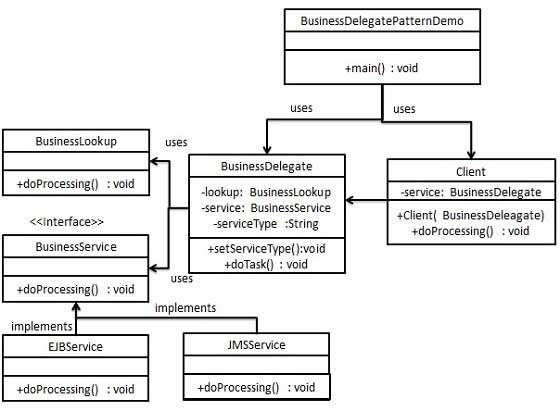

# Business Delegate Pattern

El patrón de delegado comercial se utiliza para desacoplar el nivel de presentación y el nivel comercial. Básicamente se utiliza para reducir la funcionalidad de comunicación o búsqueda remota al código de nivel empresarial en el código de nivel de presentación. En el nivel empresarial tenemos las siguientes entidades.

- *Client* - El código de nivel de presentación puede ser JSP, servlet o código Java UI.

- *Business Delegate* - una clase de punto de entrada único para que las entidades cliente proporcionen acceso a los métodos de Business Service.

- *LookUp Service* - El objeto de servicio de búsqueda es responsable de obtener la implementación comercial relativa y proporcionar acceso del objeto comercial al objeto delegado comercial.

- *Business Service* - Interfaz de Business Service. Las clases concretas implementan este servicio empresarial para brindar una lógica de implementación empresarial real.

## Implementación

Vamos a crear un Client, BusinessDelegate, BusinessService, LookUpService, JMSService y EJBService que representen varias entidades de patrones de Business Delegate.

BusinessDelegatePatternDemo, nuestra clase de demostración, utilizará BusinessDelegate y Client para demostrar el uso del patrón Business Delegate.



## Paso 1

Cree la interfaz BusinessService.

> BusinessService.java

```java
public interface BusinessService {
   public void doProcessing();
}
```

## Paso 2

Cree clases de Servicios concretas.

> EJBService.java

```java
public class EJBService implements BusinessService {

   @Override
   public void doProcessing() {
      System.out.println("Processing task by invoking EJB Service");
   }
}
```

> JMSService.java

```java
public class JMSService implements BusinessService {

   @Override
   public void doProcessing() {
      System.out.println("Processing task by invoking JMS Service");
   }
}
```

## Paso 3

Crear servicio de búsqueda empresarial.

> BusinessLookUp.java

```java
public class BusinessLookUp {
   public BusinessService getBusinessService(String serviceType){

      if(serviceType.equalsIgnoreCase("EJB")){
         return new EJBService();
      }
      else {
         return new JMSService();
      }
   }
}
```

## Paso 4

Crear delegado comercial.

> BusinessDelegate.java

```java
public class BusinessDelegate {
   private BusinessLookUp lookupService = new BusinessLookUp();
   private BusinessService businessService;
   private String serviceType;

   public void setServiceType(String serviceType){
      this.serviceType = serviceType;
   }

   public void doTask(){
      businessService = lookupService.getBusinessService(serviceType);
      businessService.doProcessing();
   }
}
```

## Paso 5

Crear Cliente

> Client.java

```java
public class Client {

   BusinessDelegate businessService;

   public Client(BusinessDelegate businessService){
      this.businessService  = businessService;
   }

   public void doTask(){
      businessService.doTask();
   }
}
```

## Paso 6

Utilice las clases BusinessDelegate y Client para demostrar el patrón Business Delegate.

> BusinessDelegatePatternDemo.java

```java
public class BusinessDelegatePatternDemo {

   public static void main(String[] args) {

      BusinessDelegate businessDelegate = new BusinessDelegate();
      businessDelegate.setServiceType("EJB");

      Client client = new Client(businessDelegate);
      client.doTask();

      businessDelegate.setServiceType("JMS");
      client.doTask();
   }
}
```

## Paso 7

Verifique la salida.

```note
Processing task by invoking EJB Service
Processing task by invoking JMS Service
```

---
:octocat: [Check more about me.](https://github.com/FernandoCalmet)

[](https://ko-fi.com/T6T41JKMI)
