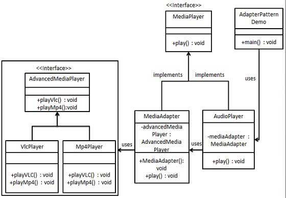

# Adapter Pattern

El patrón de adaptador funciona como un puente entre dos interfaces incompatibles. Este tipo de patrón de diseño viene bajo patrón estructural ya que este patrón combina la capacidad de dos interfaces independientes.

Este patrón involucra a una sola clase que es responsable de unir funcionalidades de interfaces independientes o incompatibles. Un ejemplo de la vida real podría ser el caso de un lector de tarjetas que actúa como adaptador entre la tarjeta de memoria y una computadora portátil. Conecta la tarjeta de memoria al lector de tarjetas y el lector de tarjetas a la computadora portátil para que la tarjeta de memoria se pueda leer a través de la computadora portátil.

Estamos demostrando el uso del patrón Adaptador mediante el siguiente ejemplo en el que un dispositivo reproductor de audio solo puede reproducir archivos mp3 y desea usar un reproductor de audio avanzado capaz de reproducir archivos vlc y mp4.

## Implementación

Tenemos una interfaz MediaPlayer y una clase concreta AudioPlayer que implementa la interfaz MediaPlayer. AudioPlayer puede reproducir archivos de audio en formato mp3 de forma predeterminada.

Tenemos otra interfaz AdvancedMediaPlayer y clases concretas que implementan la interfaz AdvancedMediaPlayer. Estas clases pueden reproducir archivos en formato vlc y mp4.

Queremos que AudioPlayer también reproduzca otros formatos. Para lograr esto, hemos creado una clase de adaptador MediaAdapter que implementa la interfaz MediaPlayer y usa objetos AdvancedMediaPlayer para reproducir el formato requerido.

AudioPlayer usa la clase de adaptador MediaAdapter pasándole el tipo de audio deseado sin conocer la clase real que puede reproducir el formato deseado. AdapterPatternDemo, nuestra clase de demostración utilizará la clase AudioPlayer para reproducir varios formatos.



## Paso 1

Cree interfaces para Media Player y Advanced Media Player.

> MediaPlayer.php

```php
<?php

declare(strict_types=1);

interface MediaPlayer
{
    public function play(string $audioType, string $fileName): void;
}
```

> AdvancedMediaPlayer.php

```php
<?php

declare(strict_types=1);

interface AdvancedMediaPlayer
{
    public function playVlc(string $fileName): void;
    public function playMp4(string $fileName): void;
}
```

## Paso 2

Cree clases concretas implementando la interfaz AdvancedMediaPlayer.

> VlcPlayer.php

```php
<?php

declare(strict_types=1);

include_once __DIR__ . '/AdvancedMediaPlayer.php';

class VlcPlayer implements AdvancedMediaPlayer
{
    public function playVlc(string $fileName): void
    {
        print sprintf("Playing vlc file. Name: %s " . PHP_EOL, $fileName);
    }

    public function playMp4(string $fileName): void
    {
        //do nothing
    }
}
```

> Mp4Player.php

```php
<?php

declare(strict_types=1);

include_once __DIR__ . '/AdvancedMediaPlayer.php';

class Mp4Player implements AdvancedMediaPlayer
{
    public function playVlc(string $fileName): void
    {
        //do nothing
    }

    public function playMp4(string $fileName): void
    {
        print sprintf("Playing mp4 file. Name: %s" . PHP_EOL, $fileName);
    }
}
```

## Paso 3

Cree una clase de adaptador implementando la interfaz MediaPlayer.

> MediaAdapter.php

```php
<?php

declare(strict_types=1);

include_once __DIR__ . '/MediaPlayer.php';
include_once __DIR__ . '/VlcPlayer.php';
include_once __DIR__ . '/Mp4Player.php';

class MediaAdapter implements MediaPlayer
{
    private $advancedMusicPlayer;

    public function __construct(string $audioType)
    {
        if (strcasecmp($audioType, "vlc")) {
            $this->advancedMusicPlayer = new VlcPlayer();
        } else if (strcasecmp($audioType, "mp4")) {
            $this->advancedMusicPlayer = new Mp4Player();
        }
    }

    public function play(string $audioType, string $filename): void
    {
        if (strcasecmp($audioType, "vlc")) {
            $this->advancedMusicPlayer->playVlc($filename);
        } else if (strcasecmp($audioType, "mp4")) {
            $this->advancedMusicPlayer->playMp4($filename);
        }
    }
}
```

## Paso 4

Cree una clase concreta implementando la interfaz MediaPlayer.

> AudioPlayer.php

```php
<?php

declare(strict_types=1);

include_once __DIR__ . '/MediaPlayer.php';
include_once __DIR__ . '/MediaAdapter.php';

class AudioPlayer implements MediaPlayer
{
    private $mediaAdapter;

    public function play(string $audioType, string $filename): void
    {
        //inbuilt support to play mp3 music files
        if (strcasecmp($audioType, "mp3") == 0) {
            print sprintf("Playing mp3 file. Name: %s: " . PHP_EOL, $filename);
        }
        //mediaAdapter is providing support to play other file formats
        else if (strcasecmp($audioType, "vlc") == 0 || strcasecmp($audioType, "mp4") == 0) {
            $this->mediaAdapter = new MediaAdapter($audioType);
            $this->mediaAdapter->play($audioType, $filename);
        } else {
            print sprintf("Invalid media. %s formate not supported" . PHP_EOL, $audioType);
        }
    }
}
```

## Paso 5

Utilice AudioPlayer para reproducir diferentes tipos de formatos de audio.

> AdapterPatternDemo.php

```php
<?php

include_once __DIR__ . '/AudioPlayer.php';

$audioplayer = new AudioPlayer();

$audioplayer->play("mp3", "beyond the horizon.mp3");
$audioplayer->play("mp4", "alone.mp4");
$audioplayer->play("vlc", "far far away.vlc");
$audioplayer->play("avi", "mind me.avi");
```

## Paso 6

Verifique la salida.

```note
Playing mp3 file. Name: beyond the horizon.mp3
Playing mp4 file. Name: alone.mp4
Playing vlc file. Name: far far away.vlc
Invalid media. avi format not supported
```

---
:octocat: [Check more about me.](https://github.com/FernandoCalmet)

[](https://ko-fi.com/T6T41JKMI)
