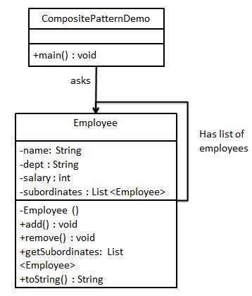

# Composite Pattern

El patrón compuesto se usa cuando necesitamos tratar un grupo de objetos de manera similar como un solo objeto. El patrón compuesto compone objetos en términos de una estructura de árbol para representar una parte y una jerarquía completa. Este tipo de patrón de diseño viene bajo patrón estructural ya que este patrón crea una estructura de árbol de grupo de objetos.

Este patrón crea una clase que contiene un grupo de sus propios objetos. Esta clase proporciona formas de modificar su grupo de mismos objetos.

Estamos demostrando el uso de un patrón compuesto a través del siguiente ejemplo en el que mostraremos la jerarquía de empleados de una organización.

## Implementación

Tenemos una clase Employee que actúa como clase de actor de patrón compuesto. CompositePatternDemo, nuestra clase de demostración utilizará la clase de empleado para agregar una jerarquía de nivel de departamento e imprimir todos los empleados.



## Paso 1

Cree una clase de empleado que tenga una lista de objetos de empleado.

> Employee.java

```java
import java.util.ArrayList;
import java.util.List;

public class Employee {
   private String name;
   private String dept;
   private int salary;
   private List<Employee> subordinates;

   // constructor
   public Employee(String name,String dept, int sal) {
      this.name = name;
      this.dept = dept;
      this.salary = sal;
      subordinates = new ArrayList<Employee>();
   }

   public void add(Employee e) {
      subordinates.add(e);
   }

   public void remove(Employee e) {
      subordinates.remove(e);
   }

   public List<Employee> getSubordinates(){
     return subordinates;
   }

   public String toString(){
      return ("Employee :[ Name : " + name + ", dept : " + dept + ", salary :" + salary+" ]");
   }
}
```

## Paso 2

Utilice la clase Empleado para crear e imprimir la jerarquía de empleados.

> CompositePatternDemo.java

```java
public class CompositePatternDemo {
   public static void main(String[] args) {

      Employee CEO = new Employee("John","CEO", 30000);

      Employee headSales = new Employee("Robert","Head Sales", 20000);

      Employee headMarketing = new Employee("Michel","Head Marketing", 20000);

      Employee clerk1 = new Employee("Laura","Marketing", 10000);
      Employee clerk2 = new Employee("Bob","Marketing", 10000);

      Employee salesExecutive1 = new Employee("Richard","Sales", 10000);
      Employee salesExecutive2 = new Employee("Rob","Sales", 10000);

      CEO.add(headSales);
      CEO.add(headMarketing);

      headSales.add(salesExecutive1);
      headSales.add(salesExecutive2);

      headMarketing.add(clerk1);
      headMarketing.add(clerk2);

      //print all employees of the organization
      System.out.println(CEO);

      for (Employee headEmployee : CEO.getSubordinates()) {
         System.out.println(headEmployee);

         for (Employee employee : headEmployee.getSubordinates()) {
            System.out.println(employee);
         }
      }
   }
}
```

## Paso 3

Verifique la salida.

```note
Employee :[ Name : John, dept : CEO, salary :30000 ]
Employee :[ Name : Robert, dept : Head Sales, salary :20000 ]
Employee :[ Name : Richard, dept : Sales, salary :10000 ]
Employee :[ Name : Rob, dept : Sales, salary :10000 ]
Employee :[ Name : Michel, dept : Head Marketing, salary :20000 ]
Employee :[ Name : Laura, dept : Marketing, salary :10000 ]
Employee :[ Name : Bob, dept : Marketing, salary :10000 ]
```

---
:octocat: [Check more about me.](https://github.com/FernandoCalmet)

[](https://ko-fi.com/T6T41JKMI)
