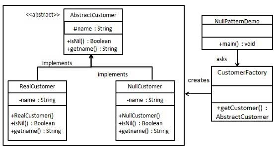

# Null Object Pattern

En el patrón de objeto nulo, un objeto nulo reemplaza la comprobación de la instancia de objeto NULO. En lugar de poner if check para un valor nulo, Null Object refleja una relación de no hacer nada. Dicho objeto nulo también se puede utilizar para proporcionar un comportamiento predeterminado en caso de que los datos no estén disponibles.

En el patrón de objeto nulo, creamos una clase abstracta que especifica varias operaciones a realizar, clases concretas que extienden esta clase y una clase de objeto nulo que proporciona una implementación sin hacer nada de esta clase y se usará sin problemas cuando necesitemos verificar el valor nulo.

## Implementación

Vamos a crear una clase abstracta AbstractCustomer que defina las operaciones. Aquí el nombre del cliente y las clases concretas que extienden la clase AbstractCustomer. Se crea una clase de fábrica CustomerFactory para devolver objetos RealCustomer o NullCustomer en función del nombre del cliente que se le ha pasado.

NullPatternDemo, nuestra clase de demostración, utilizará CustomerFactory para demostrar el uso del patrón de objeto nulo.



## Paso 1

Crea una clase abstracta.

> AbstractCustomer.java

```java
public abstract class AbstractCustomer {
   protected String name;
   public abstract boolean isNil();
   public abstract String getName();
}
```

## Paso 2

Cree clases concretas ampliando la clase anterior.

> RealCustomer.java

```java
public class RealCustomer extends AbstractCustomer {

   public RealCustomer(String name) {
      this.name = name;
   }

   @Override
   public String getName() {
      return name;
   }

   @Override
   public boolean isNil() {
      return false;
   }
}
```

> NullCustomer.java

```java
public class NullCustomer extends AbstractCustomer {

   @Override
   public String getName() {
      return "Not Available in Customer Database";
   }

   @Override
   public boolean isNil() {
      return true;
   }
}
```

## Paso 3

Crear clase CustomerFactory.

> CustomerFactory.java

```java
public class CustomerFactory {

   public static final String[] names = {"Rob", "Joe", "Julie"};

   public static AbstractCustomer getCustomer(String name){

      for (int i = 0; i < names.length; i++) {
         if (names[i].equalsIgnoreCase(name)){
            return new RealCustomer(name);
         }
      }
      return new NullCustomer();
   }
}
```

## Paso 4

Utilice CustomerFactory para obtener objetos RealCustomer o NullCustomer en función del nombre del cliente que se le haya pasado.

> NullPatternDemo.java

```java
public class NullPatternDemo {
   public static void main(String[] args) {

      AbstractCustomer customer1 = CustomerFactory.getCustomer("Rob");
      AbstractCustomer customer2 = CustomerFactory.getCustomer("Bob");
      AbstractCustomer customer3 = CustomerFactory.getCustomer("Julie");
      AbstractCustomer customer4 = CustomerFactory.getCustomer("Laura");

      System.out.println("Customers");
      System.out.println(customer1.getName());
      System.out.println(customer2.getName());
      System.out.println(customer3.getName());
      System.out.println(customer4.getName());
   }
}
```

## Paso 5

Verifique la salida.

```note
Customers
Rob
Not Available in Customer Database
Julie
Not Available in Customer Database
```

---
:octocat: [Check more about me.](https://github.com/FernandoCalmet)

[](https://ko-fi.com/T6T41JKMI)
