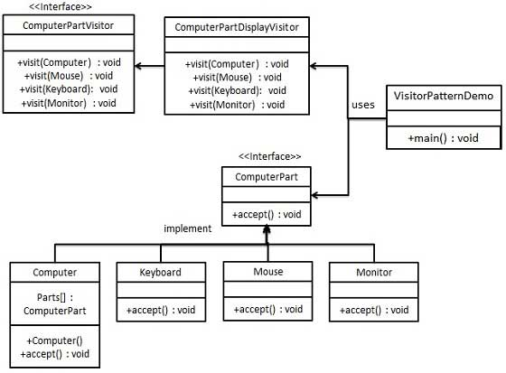

# Visitor Pattern

En el patrón de visitante, usamos una clase de visitante que cambia el algoritmo de ejecución de una clase de elemento. De esta manera, el algoritmo de ejecución del elemento puede variar a medida que varía el visitante. Este patrón se incluye en la categoría de patrón de comportamiento. Según el patrón, el objeto del elemento tiene que aceptar el objeto del visitante para que el objeto del visitante maneje la operación en el objeto del elemento.

## Implementación

Vamos a crear una interfaz ComputerPart que defina aceptar operación. Teclado, Mouse, Monitor y Computadora son clases concretas que implementan la interfaz ComputerPart. Definiremos otra interfaz ComputerPartVisitor que definirá las operaciones de una clase de visitante. La computadora utiliza al visitante concreto para realizar la acción correspondiente.

VisitorPatternDemo, nuestra clase de demostración, utilizará las clases Computer y ComputerPartVisitor para demostrar el uso del patrón de visitante.



## Paso 1

Defina una interfaz para representar el elemento.

> ComputerPart.java

```java
public interface ComputerPart {
   public void accept(ComputerPartVisitor computerPartVisitor);
}
```

## Paso 2

Cree clases concretas ampliando la clase anterior.

> Keyboard.java

```java
public class Keyboard implements ComputerPart {

   @Override
   public void accept(ComputerPartVisitor computerPartVisitor) {
      computerPartVisitor.visit(this);
   }
}
```

> Monitor.java

```java
public class Monitor implements ComputerPart {

   @Override
   public void accept(ComputerPartVisitor computerPartVisitor) {
      computerPartVisitor.visit(this);
   }
}
```

> Mouse.java

```java
public class Mouse implements ComputerPart {

   @Override
   public void accept(ComputerPartVisitor computerPartVisitor) {
      computerPartVisitor.visit(this);
   }
}
```

> Computer.java

```java
public class Computer implements ComputerPart {

   ComputerPart[] parts;

   public Computer(){
      parts = new ComputerPart[] {new Mouse(), new Keyboard(), new Monitor()};
   }


   @Override
   public void accept(ComputerPartVisitor computerPartVisitor) {
      for (int i = 0; i < parts.length; i++) {
         parts[i].accept(computerPartVisitor);
      }
      computerPartVisitor.visit(this);
   }
}
```

## Paso 3

Definir una interfaz para representar a la visitante.

> ComputerPartVisitor.java

```java
public interface ComputerPartVisitor {
   public void visit(Computer computer);
   public void visit(Mouse mouse);
   public void visit(Keyboard keyboard);
   public void visit(Monitor monitor);
}
```

## Paso 4

Crear visitante concreta implementando la clase anterior.

> ComputerPartDisplayVisitor.java

```java
public class ComputerPartDisplayVisitor implements ComputerPartVisitor {

   @Override
   public void visit(Computer computer) {
      System.out.println("Displaying Computer.");
   }

   @Override
   public void visit(Mouse mouse) {
      System.out.println("Displaying Mouse.");
   }

   @Override
   public void visit(Keyboard keyboard) {
      System.out.println("Displaying Keyboard.");
   }

   @Override
   public void visit(Monitor monitor) {
      System.out.println("Displaying Monitor.");
   }
}
```

## Paso 5

Utilice ComputerPartDisplayVisitor para mostrar partes de Computer.

> VisitorPatternDemo.java

```java
public class VisitorPatternDemo {
   public static void main(String[] args) {

      ComputerPart computer = new Computer();
      computer.accept(new ComputerPartDisplayVisitor());
   }
}
```

## Paso 6

Verifique la salida.

```note
Displaying Mouse.
Displaying Keyboard.
Displaying Monitor.
Displaying Computer.
```

---
:octocat: [Check more about me.](https://github.com/FernandoCalmet)

[](https://ko-fi.com/T6T41JKMI)
